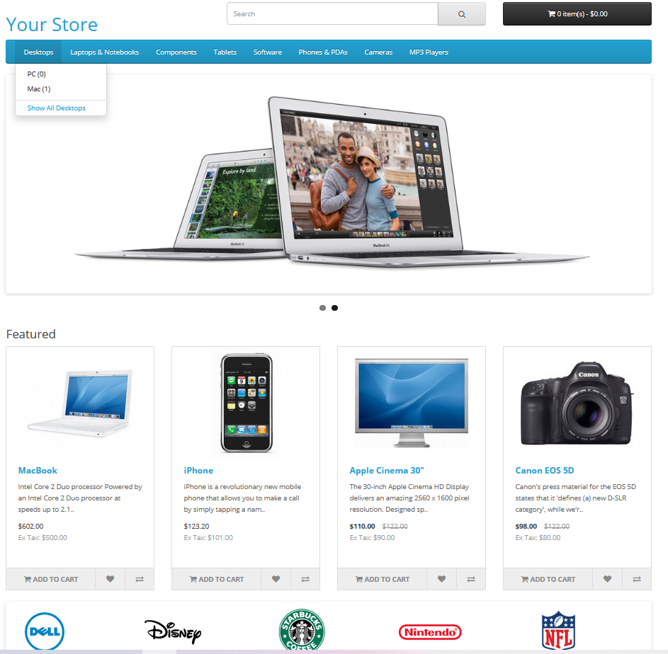
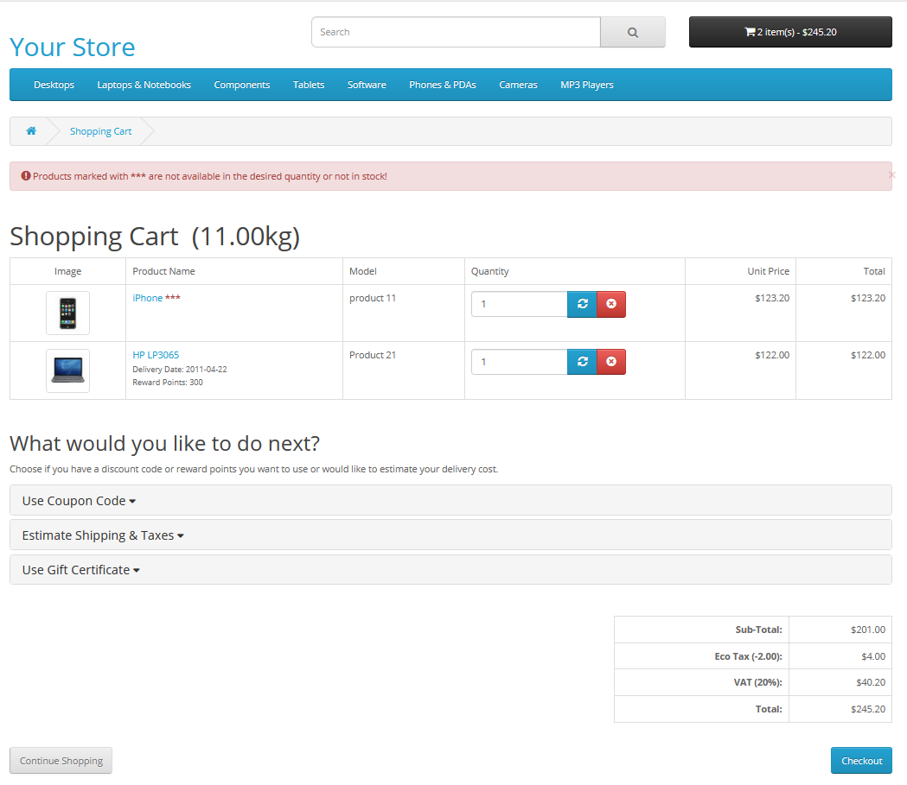
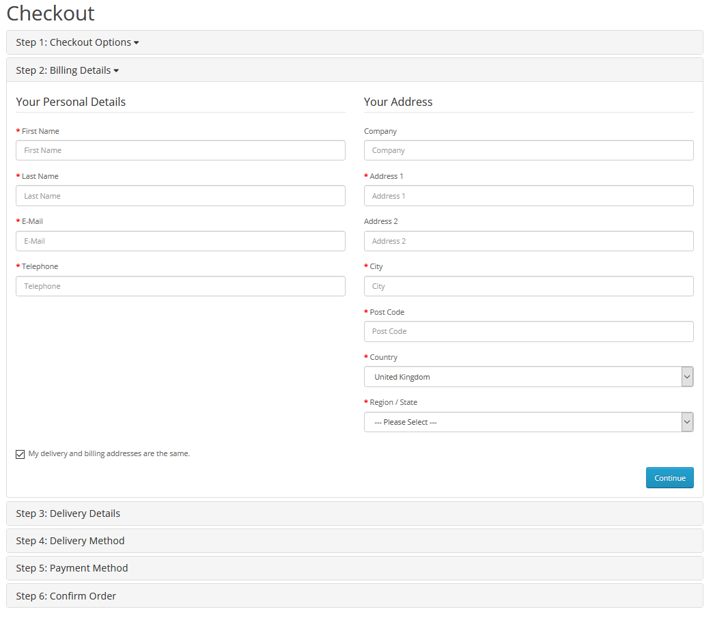

# E-Commerce-Website-Automation [Selenium + Python]

 Youtube reference: https://www.youtube.com/watch?v=e9Bf769mXu0

-----------------------------------------------------------------------------------------------------

In this project, we will simulate and automate a purchase scenario from an E-Commerce- Website with Selenium & Python.

The goal is to buy different electronic devices, select the delivery date and complete the checkout process.
--------------------------------------------

